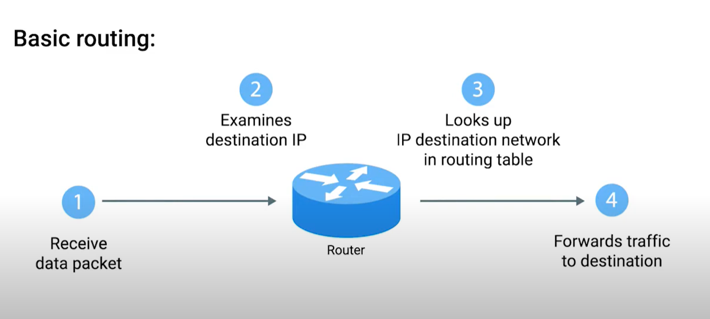

# Basics of Routing

## Router 
Router is basically a newtwork device that forwards traffic depending on the destination address of that traffic. A router has at least two network interfaces since it has to be connected to two network devices to do its job. 

Basic Routing looks like: 
