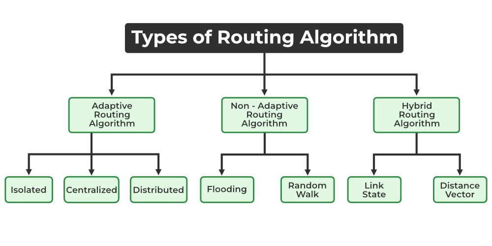

# Background for Routing Algorithms

## Classification of Routing Algorithms
Routing is the process of establishing the routes that data packets must follow to reach the destination. In this process, a routing table is created which contains information regarding routes that data packets follow. Various routing algorithms are used for the purpose of deciding which route an incoming data packet needs to be transmitted on to reach the destination efficiently. 

Classification of Routing Algorithms
The routing algorithms can be classified as follows: 
1. Adaptive Algorithms
2. Non-Adaptive Algorithms
3. Hybrid Algorithms

1. Adaptive Algorithm 
These are the algorithms that change their routing decisions whenever network topology or traffic load changes. The changes in routing decisions are reflected in the topology as well as the traffic of the network. Also known as dynamic routing, these make use of dynamic information such as current topology, load, delay, etc. to select routes. Optimization parameters are distance, number of hops, and estimated transit time.  

Further, these are classified as follows:   
- Isolated: In this method each, node makes its routing decisions using the information it has without seeking information from other nodes. The sending nodes don’t have information about the status of a particular link. The disadvantage is that packets may be sent through a congested network which may result in delay. Examples: Hot potato routing, and backward learning.           
- Centralized: In this method, a centralized node has entire information about the network and makes all the routing decisions. The advantage of this is only one node is required to keep the information of the entire network and the disadvantage is that if the central node goes down the entire network is done. The link state algorithm is referred to as a centralized algorithm since it is aware of the cost of each link in the network. 
- Distributed: In this method, the node receives information from its neighbors and then takes the decision about routing the packets. A disadvantage is that the packet may be delayed if there is a change in between intervals in which it receives information and sends packets. It is also known as a decentralized algorithm as it computes the least-cost path between source and destination.

2. Non Adaptive Algorithms
These are the algorithms that do not change their routing decisions once they have been selected. This is also known as static routing as a route to be taken is computed in advance and downloaded to routers when a router is booted. 

Further, these are classified as follows: 

1. Flooding: This adapts the technique in which every incoming packet is sent on every outgoing line except from which it arrived. One problem with this is that packets may go in a loop and as a result of which a node may receive duplicate packets. These problems can be overcome with the help of sequence numbers, hop count, and spanning trees. 
2. Random walk: In this method, packets are sent host by host or node by node to one of its neighbors randomly. This is a highly robust method that is usually implemented by sending packets onto the link which is least queued.
---
3. Hybrid Algorithms
As the name suggests, these algorithms are a combination of both adaptive and non-adaptive algorithms. In this approach, the network is divided into several regions, and each region uses a different algorithm. 
Further, these are classified as follows:

Link-state: In this method, each router creates a detailed and complete map of the network which is then shared with all other routers. This allows for more accurate and efficient routing decisions to be made.
Distance vector: In this method, each router maintains a table that contains information about the distance and direction to every other node in the network. This table is then shared with other routers in the network. The disadvantage of this method is that it may lead to routing loops.

- There are two types of Routing Protocols: 
1. Exterior Gateway protocols - used to access autonomous networks i.e outside the current network. 
2. Interior Gateway Protocols - used to access nodes within a network. 

- Interior Gateway Protocols: 
Distance Vector [based on Bellman Ford Algorithm]
  |- RIP : Routing Information Protocol
  |- EIGRP : Enhanced Interior Gateway Routing Protocol
In these kind of protoocols every router maintains the distance vector which is shortest distance to every other router in network.

Link State 
  |- ISIS
  |- OSPF
Exterior protocol example is BGP. 
Also we can have different types of casting so different type of algorithms might be required for different types of casting. 

In routing algorithms we use the term cost, we basically build the graph then we find the shortest path. 
so when we say shortest path we mean cost of a link. And we want to find the path with minmum cost.
How do we find the cost ?
 |- bandwidth
 |- network delay
 |- Hop count
 |- Path cost
 |- Load
 |- Maximum Transmission unit
