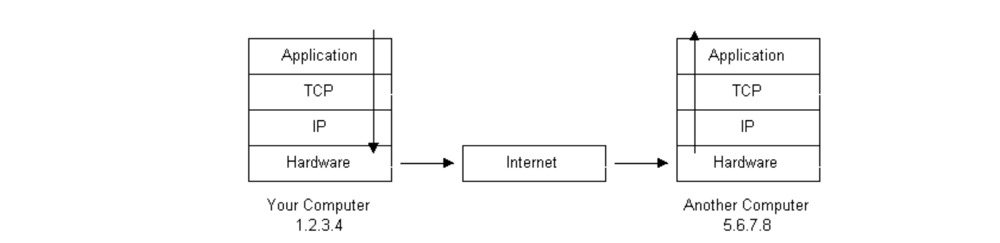
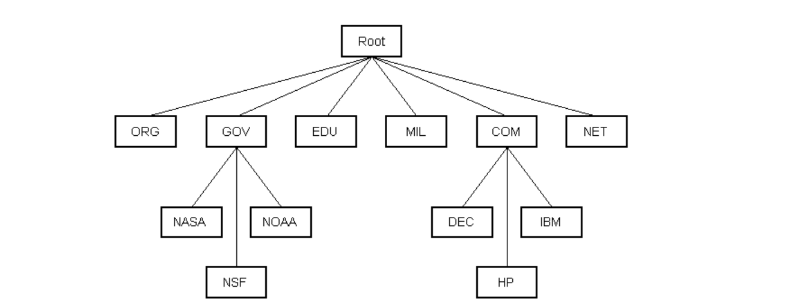
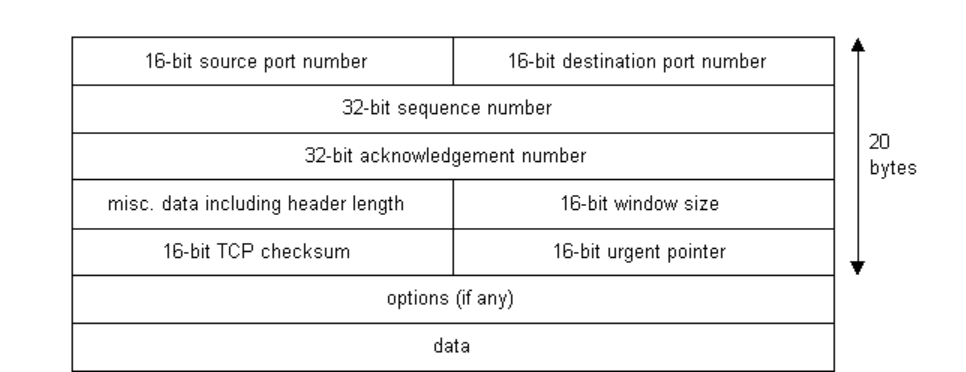
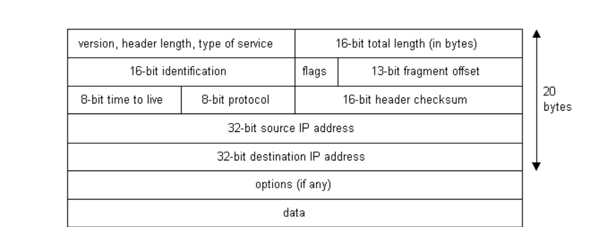

# How does the Internet work?
---
## Internet Addresses

Because the Internet is a global network of computers each computer connected to the Internet must have a unique address. Internet addresses are in the form `nnn.nnn.nnn.nnn` where `nnn` must be a number from 0 - 255. This address is known as an *IP address*.

If you connect to the Internet through an Internet Service Provider (ISP), you are usually assigned a temporary IP address for the duration of your dial-in session. If you connect to the Internet from a local area network (LAN) your computer might have a permanent IP address or it might obtain a temporary one from a DHCP (Dynamic Host Configuration Protocol) server.

---

_There is a handy program to see if a computer on the Internet is alive. It's called ping, probably after the sound made by older submarine sonar systems.If you are using Windows, start a command prompt window. If you're using a flavor of Unix, get to a command prompt. Type ping www.yahoo.com. The ping program will send a 'ping' (actually an ICMP (Internet Control Message Protocol) echo request message) to the named computer. The pinged computer will respond with a reply. The ping program will count the time expired until the reply comes back (if it does). Also, if you enter a domain name (i.e. www.yahoo.com) instead of an IP address, ping will resolve the domain name and display the computer's IP address._

---

## Protocol Stacks and Packets

So your computer is connected to the Internet and has a unique address. How does it 'talk' to other computers connected to the Internet? An example should serve here: Let's say your IP address is 1.2.3.4 and you want to send a message to the computer 5.6.7.8. The message you want to send is "Hello computer 5.6.7.8!". Obviously, the message must be transmitted over whatever kind of wire connects your computer to the Internet. Let's say you've dialed into your ISP from home and the message must be transmitted over the phone line. Therefore the message must be translated from alphabetic text into electronic signals, transmitted over the Internet, then translated back into alphabetic text. How is this accomplished? Through the use of a protocol stack. Every computer needs one to communicate on the Internet and it is usually built into the computer's operating system (i.e. Windows, Unix, etc.). The protocol stack used on the Internet is refered to as the TCP/IP protocol stack because of the two major communication protocols used. The TCP/IP stack looks like this:

| Protocol Layer                      | Comments                                                                         |
| ----------------------------------- | -------------------------------------------------------------------------------- |
| Application Protocols Layer         | Protocols specific to applications such as WWW, e-mail, FTP, etc.                |
| Transmission Control Protocol Layer | TCP directs packets to a specific application on a computer using a port number. |
| Internet Protocol Layer             | IP directs packets to a specific computer using an IP address.                   |
| Hardware Layer                      | Converts binary packet data to network signals and back.                         |
|                                     | (E.g. ethernet network card, modem for phone lines, etc.)                        |

---

If we were to follow the path that the message "Hello computer 5.6.7.8!" took from our computer to the computer with IP address 5.6.7.8, it would happen something like this:


1. The message would start at the top of the protocol stack on your computer and work it's way downward.
2. If the message to be sent is long, each stack layer that the message passes through may break the message up into smaller chunks of data. This is because data sent over the Internet (and most computer networks) are sent in manageable chunks. On the Internet, these chunks of data are known as packets.
3. The packets would go through the Application Layer and continue to the TCP layer. Each packet is assigned a port number. Ports will be explained later, but suffice to say that many programs may be using the TCP/IP stack and sending messages. We need to know which program on the destination computer needs to receive the message because it will be listening on a specific port.
4. After going through the TCP layer, the packets proceed to the IP layer. This is where each packet receives it's destination address, 5.6.7.8.
5. Now that our message packets have a port number and an IP address, they are ready to be sent over the Internet. The hardware layer takes care of turning our packets containing the alphabetic text of our message into electronic signals and transmitting them over the phone line.
6. On the other end of the phone line your ISP has a direct connection to the Internet. The ISPs router examines the destination address in each packet and determines where to send it. Often, the packet's next stop is another router.
7. Eventually, the packets reach computer 5.6.7.8. Here, the packets start at the bottom of the destination computer's TCP/IP stack and work upwards.
8. As the packets go upwards through the stack, all routing data that the sending computer's stack added (such as IP address and port number) is stripped from the packets.
9. When the data reaches the top of the stack, the packets have been re-assembled into their original form, "Hello computer 5.6.7.8!"

### Application Protocols Layer
The Application Protocols Layer is the topmost layer in the protocol stack, responsible for handling protocols specific to applications. It provides communication services and protocols that enable applications to exchange data over a network. This layer defines the rules and standards for how applications should communicate with each other.

Some common application protocols include:

1. World Wide Web (WWW): The HTTP (Hypertext Transfer Protocol) protocol is used for retrieving and displaying web pages in browsers. It enables communication between web servers and clients.

2. Email: Protocols such as SMTP (Simple Mail Transfer Protocol) and IMAP (Internet Message Access Protocol) are used for sending and receiving emails.

3. File Transfer Protocol (FTP): FTP is used for transferring files between computers over a network. It provides a set of commands for file operations like upload, download, rename, delete, etc.

4. Domain Name System (DNS): DNS is responsible for converting human-readable domain names (e.g., www.example.com) into IP addresses that computers can understand.

5. Simple Network Management Protocol (SNMP): SNMP is used for managing and monitoring network devices, such as routers, switches, and servers.

6. Simple Object Access Protocol (SOAP): SOAP is a protocol used for exchanging structured information in web services. It enables communication between different applications and platforms.

Each application protocol has its own set of rules and standards for data formatting, addressing, and error handling. These protocols define how data is packaged, transmitted, and received between applications.

The Application Protocols Layer interacts with the lower layers of the protocol stack, such as the Transmission Control Protocol (TCP) or User Datagram Protocol (UDP) layers, to ensure reliable and efficient communication between applications.

---

### Transmission Control Protocol (TCP)
The Transmission Control Protocol (TCP) layer is a core component of the Internet Protocol Suite. It operates as a transport layer protocol and is responsible for providing reliable, connection-oriented communication between applications running on different devices over an IP network.

Here are key characteristics and functions of the Transmission Control Protocol (TCP) layer:

1. Reliable Communication: TCP ensures reliable delivery of data by implementing mechanisms such as acknowledgments, retransmissions, and flow control. It guarantees that data sent from one end is received correctly and in the same order by the other end.

2. Connection-Oriented: TCP establishes a connection between two devices before transmitting data. It follows a three-way handshake process (SYN, SYN-ACK, ACK) to establish and synchronize the connection. This connection-oriented nature ensures reliable and ordered data transfer.

3. Stream Transmission: TCP treats data as a stream of bytes rather than discrete packets. It breaks down the data into segments and assigns sequence numbers to each segment for ordering purposes. The receiver reassembles the segments into the original data stream.

4. Flow Control: TCP uses a sliding window mechanism for flow control. It dynamically adjusts the amount of data transmitted based on the receiver's capacity to handle incoming data. This prevents overwhelming the receiver with more data than it can process.

5. Congestion Control: TCP helps manage network congestion by utilizing congestion control algorithms. It monitors network conditions, detects congestion signs, and adjusts the transmission rate to alleviate congestion and prevent network collapse.

6. Port Numbers: TCP uses port numbers to identify specific applications running on devices. It ensures that incoming data is directed to the correct application based on the destination port number.

7. Error Detection and Correction: TCP employs various error detection mechanisms, including checksums, to verify the integrity of transmitted data. If errors are detected, TCP requests retransmission of the corrupted segments.

8. Full-Duplex Communication: TCP enables simultaneous bidirectional communication between devices, allowing data to be transmitted in both directions concurrently.

TCP is widely used for many applications that require reliable and ordered data transfer, such as web browsing, file transfer, email, and remote access. It works in conjunction with the lower-level Internet Protocol (IP) layer to provide end-to-end communication across networks. 

---

### The Internet Protocol (IP) 
The Internet Protocol (IP) layer is a fundamental component of the Internet Protocol Suite. It operates as a network layer protocol and is responsible for facilitating the exchange of data packets between devices on a computer network.

Here are the key characteristics and functions of the Internet Protocol (IP) layer:

1. Addressing: IP provides a unique logical address called an IP address to each device connected to a network. IP addresses are used to identify the source and destination of data packets. IPv4 (Internet Protocol version 4) uses 32-bit addresses, while IPv6 (Internet Protocol version 6) uses 128-bit addresses.

2. Packet Routing: IP is responsible for routing data packets from the source device to the destination device across an interconnected network of routers. It uses routing tables and algorithms to determine the optimal path for packet transmission based on IP addresses and network conditions.

3. Fragmentation and Reassembly: IP handles packet fragmentation and reassembly when the data to be transmitted exceeds the maximum size allowed by the underlying network technology. It splits large packets into smaller fragments at the sender and reassembles them at the receiver.

4. Best Effort Delivery: IP provides best-effort delivery, which means it does not guarantee reliable or ordered delivery of packets. It assumes an unreliable network environment where packets may be lost, delayed, or delivered out of order. Error detection and correction are typically handled by higher-layer protocols.

5. Protocol Versioning: IP supports multiple versions, such as IPv4 and IPv6. IPv4 has been widely used and is still in use today, but IPv6 is gradually being adopted to address the limitations of IPv4 and accommodate the growing number of devices on the Internet.

6. Internet Protocol Suite Integration: IP works in conjunction with other protocols in the Internet Protocol Suite, such as TCP (Transmission Control Protocol) and UDP (User Datagram Protocol), to provide end-to-end communication between applications running on different devices.

7. Internet Routing: IP enables the interconnection of multiple networks, forming the global Internet. It allows packets to traverse different networks, including local area networks (LANs), wide area networks (WANs), and the Internet backbone, to reach their destination.

The IP layer plays a crucial role in enabling communication between devices across different networks. It provides the foundation for packet routing, addressing, and interconnectivity in the Internet. Higher-level protocols, such as TCP and UDP, rely on IP for the delivery of their data packets.

---

## Networking Infrastructure

When packets travel from one computer to another over the Internet, they pass through multiple network devices and infrastructure components. Here's a high-level overview of the typical path packets take:

1. Source Device: The journey begins at the source device, which could be a computer, smartphone, or any other network-connected device. The source device generates data packets and sends them into the network.

2. Local Network: The packets first reach the local network to which the source device is connected. This could be a home network, office network, or any local area network (LAN). The local network consists of routers, switches, and other network devices that facilitate communication within the network.

3. Internet Service Provider (ISP): The local network connects to an Internet Service Provider (ISP). The ISP is responsible for providing access to the Internet. The packets leave the local network and enter the ISP's network infrastructure.

4. ISP Network: Within the ISP's network, the packets traverse a series of routers and switches. These devices direct the packets towards their destination based on routing tables and protocols. The ISP network is connected to other ISPs and the Internet backbone, forming a vast network of interconnected routers.

5. Internet Backbone: The Internet backbone consists of high-speed, long-distance network links that interconnect various ISPs and network providers. These backbone networks span across countries and continents, providing the backbone infrastructure for global Internet connectivity. The packets travel across the Internet backbone, hopping between routers at different locations.

6. Destination ISP: Eventually, the packets reach the network infrastructure of the destination ISP. The destination ISP receives the packets and begins routing them towards the destination computer.

7. Destination Network: The packets enter the destination network, which could be another local network or a different type of network. Similar to the source network, the destination network consists of routers, switches, and other devices that facilitate communication within the network.

8. Destination Device: Finally, the packets reach the destination device, which could be a computer, server, or any other network-connected device. The destination device receives the packets, processes them, and delivers the data to the intended application or service.

Throughout this journey, packets travel across various network devices, including routers, switches, and other networking equipment. These devices examine the packet headers, determine the appropriate path for forwarding, and transmit the packets to the next hop based on the destination IP address. The process of routing packets across networks is governed by routing protocols, routing tables, and network infrastructure configurations.

It's important to note that the actual path and network topology may vary depending on factors such as network congestion, routing policies, network agreements between ISPs, and the geographical distance between the source and destination. Additionally, various security measures, such as firewalls and network address translation (NAT), may be in place to protect the networks and devices involved in the packet transmission.

---

*The Traceroute Program*  
*If you're using Microsoft Windows or a flavor of Unix and have a connection to the Internet, here is another handy Internet program. This one is called traceroute and it shows the path your packets are taking to a given Internet destination. Like ping, you must use traceroute from a command prompt. In Windows, use tracert www.yahoo.com. From a Unix prompt, type traceroute www.yahoo.com. Like ping, you may also enter IP addresses instead of domain names. Traceroute will print out a list of all the routers, computers, and any other Internet entities that your packets must travel through to get to their destination.*

---

## Internet Infrastructure
The Internet backbone is made up of many large networks which interconnect with each other. These large networks are known as Network Service Providers or NSPs. Some of the large NSPs are UUNet, CerfNet, IBM, BBN Planet, SprintNet, PSINet, as well as others. These networks peer with each other to exchange packet traffic. Each NSP is required to connect to three Network Access Points or NAPs. At the NAPs, packet traffic may jump from one NSP's backbone to another NSP's backbone. NSPs also interconnect at Metropolitan Area Exchanges or MAEs. MAEs serve the same purpose as the NAPs but are privately owned. NAPs were the original Internet interconnect points. Both NAPs and MAEs are referred to as Internet Exchange Points or IXs. NSPs also sell bandwidth to smaller networks, such as ISPs and smaller bandwidth providers. Below is a picture showing this hierarchical infrastructure.


---

## The Internet Routing Hierarchy
So how do packets find their way across the Internet? Does every computer connected to the Internet know where the other computers are? Do packets simply get 'broadcast' to every computer on the Internet? The answer to both the preceeding questions is 'no'. No computer knows where any of the other computers are, and packets do not get sent to every computer. The information used to get packets to their destinations are contained in routing tables kept by each router connected to the Internet.
Routers are packet switches. A router is usually connected between networks to route packets between them. Each router knows about it's sub-networks and which IP addresses they use. The router usually doesn't know what IP addresses are 'above' it. Examine Diagram 5 below. The black boxes connecting the backbones are routers. The larger NSP backbones at the top are connected at a NAP. Under them are several sub-networks, and under them, more sub-networks. At the bottom are two local area networks with computers attached.


When a packet arrives at a router, the router examines the IP address put there by the IP protocol layer on the originating computer. The router checks it's routing table. If the network containing the IP address is found, the packet is sent to that network. If the network containing the IP address is not found, then the router sends the packet on a default route, usually up the backbone hierarchy to the next router. Hopefully the next router will know where to send the packet. If it does not, again the packet is routed upwards until it reaches a NSP backbone. The routers connected to the NSP backbones hold the largest routing tables and here the packet will be routed to the correct backbone, where it will begin its journey 'downward' through smaller and smaller networks until it finds it's destination.

---

## Domain Names and Address Resolution
But what if you don't know the IP address of the computer you want to connect to? What if the you need to access a web server referred to as www.anothercomputer.com? How does your web browser know where on the Internet this computer lives? The answer to all these questions is the Domain Name Service or DNS. The DNS is a distributed database which keeps track of computer's names and their corresponding IP addresses on the Internet.
Many computers connected to the Internet host part of the DNS database and the software that allows others to access it. These computers are known as DNS servers. No DNS server contains the entire database; they only contain a subset of it. If a DNS server does not contain the domain name requested by another computer, the DNS server re-directs the requesting computer to another DNS server.



The Domain Name Service is structured as a hierarchy similar to the IP routing hierarchy. The computer requesting a name resolution will be re-directed 'up' the hierarchy until a DNS server is found that can resolve the domain name in the request. Figure 6 illustrates a portion of the hierarchy. At the top of the tree are the domain roots. Some of the older, more common domains are seen near the top. What is not shown are the multitude of DNS servers around the world which form the rest of the hierarchy.
When an Internet connection is setup (e.g. for a LAN or Dial-Up Networking in Windows), one primary and one or more secondary DNS servers are usually specified as part of the installation. This way, any Internet applications that need domain name resolution will be able to function correctly. For example, when you enter a web address into your web browser, the browser first connects to your primary DNS server. After obtaining the IP address for the domain name you entered, the browser then connects to the target computer and requests the web page you wanted.

---

## Application Protocols: HTTP and the World Wide Web
One of the most commonly used services on the Internet is the World Wide Web (WWW). The application protocol that makes the web work is Hypertext Transfer Protocol or HTTP. Do not confuse this with the Hypertext Markup Language (HTML). HTML is the language used to write web pages. HTTP is the protocol that web browsers and web servers use to communicate with each other over the Internet. It is an application level protocol because it sits on top of the TCP layer in the protocol stack and is used by specific applications to talk to one another. In this case the applications are web browsers and web servers.

HTTP is a connectionless text based protocol. Clients (web browsers) send requests to web servers for web elements such as web pages and images. After the request is serviced by a server, the connection between client and server across the Internet is disconnected. A new connection must be made for each request. Most protocols are connection oriented. This means that the two computers communicating with each other keep the connection open over the Internet. HTTP does not however. Before an HTTP request can be made by a client, a new connection must be made to the server.

When you type a URL into a web browser, this is what happens:

1. If the URL contains a domain name, the browser first connects to a domain name server and retrieves the corresponding IP address for the web server.
2. The web browser connects to the web server and sends an HTTP request (via the protocol stack) for the desired web page.
3. The web server receives the request and checks for the desired page. If the page exists, the web server sends it. If the server cannot find the requested page, it will send an HTTP 404 error message. (404 means 'Page Not Found' as anyone who has surfed the web probably knows.)
4. The web browser receives the page back and the connection is closed.
5. The browser then parses through the page and looks for other page elements it needs to complete the web page. These usually 6.include images, applets, etc.
6. For each element needed, the browser makes additional connections and HTTP requests to the server for each element.
When the browser has finished loading all images, applets, etc. the page will be completely loaded in the browser window.
7. When the browser has finished loading all images, applets, etc. the page will be completely loaded in the browser window.

---

## Application Protocols: SMTP and Electronic Mail
Another commonly used Internet service is electronic mail. E-mail uses an application level protocol called Simple Mail Transfer Protocol or SMTP. SMTP is also a text based protocol, but unlike HTTP, SMTP is connection oriented. SMTP is also more complicated than HTTP. There are many more commands and considerations in SMTP than there are in HTTP.
When you open your mail client to read your e-mail, this is what typically happens:

1. The mail client (Netscape Mail, Lotus Notes, Microsoft Outlook, etc.) opens a connection to it's default mail server. The mail server's IP address or domain name is typically setup when the mail client is installed.
2. The mail server will always transmit the first message to identify itself.
3. The client will send an SMTP HELO command to which the server will respond with a 250 OK message.
4. Depending on whether the client is checking mail, sending mail, etc. the appropriate SMTP commands will be sent to the server, which will respond accordingly.
5. This request/response transaction will continue until the client sends an SMTP QUIT command. The server will then say goodbye and the connection will be closed.

A simple 'conversation' between an SMTP client and SMTP server is shown below. R: denotes messages sent by the server (receiver) and S: denotes messages sent by the client (sender).
      This SMTP example shows mail sent by Smith at host USC-ISIF, to
      Jones, Green, and Brown at host BBN-UNIX.  Here we assume that
      host USC-ISIF contacts host BBN-UNIX directly.  The mail is
      accepted for Jones and Brown.  Green does not have a mailbox at
      host BBN-UNIX.

      -------------------------------------------------------------

         R: 220 BBN-UNIX.ARPA Simple Mail Transfer Service Ready
         S: HELO USC-ISIF.ARPA
         R: 250 BBN-UNIX.ARPA

         S: MAIL FROM:<Smith@USC-ISIF.ARPA>
         R: 250 OK

         S: RCPT TO:<Jones@BBN-UNIX.ARPA>
         R: 250 OK

         S: RCPT TO:<Green@BBN-UNIX.ARPA>
         R: 550 No such user here

         S: RCPT TO:<Brown@BBN-UNIX.ARPA>
         R: 250 OK

         S: DATA
         R: 354 Start mail input; end with <CRLF>.<CRLF>
         S: Blah blah blah...
         S: ...etc. etc. etc.
         S: .
         R: 250 OK

         S: QUIT
         R: 221 BBN-UNIX.ARPA Service closing transmission channel

---
## Transmission Control Protocol
Under the application layer in the protocol stack is the TCP layer. When applications open a connection to another computer on the Internet, the messages they send (using a specific application layer protocol) get passed down the stack to the TCP layer. TCP is responsible for routing application protocols to the correct application on the destination computer. To accomplish this, port numbers are used. Ports can be thought of as seperate channels on each computer. For example, you can surf the web while reading e-mail. This is because these two applications (the web browser and the mail client) used different port numbers. When a packet arrives at a computer and makes its way up the protocol stack, the TCP layer decides which application receives the packet based on a port number.
TCP works like this:

- When the TCP layer receives the application layer protocol data from above, it segments it into manageable 'chunks' and then adds a TCP header with specific TCP information to each 'chunk'. The information contained in the TCP header includes the port number of the application the data needs to be sent to.
- When the TCP layer receives a packet from the IP layer below it, the TCP layer strips the TCP header data from the packet, does some data reconstruction if necessary, and then sends the data to the correct application using the port number taken from the TCP header.

This is how TCP routes the data moving through the protocol stack to the correct application.

TCP is not a textual protocol. TCP is a connection-oriented, reliable, byte stream service. Connection-oriented means that two applications using TCP must first establish a connection before exchanging data. TCP is reliable because for each packet received, an acknowledgement is sent to the sender to confirm the delivery. TCP also includes a checksum in it's header for error-checking the received data. The TCP header looks like this:



Notice that there is no place for an IP address in the TCP header. This is because TCP doesn't know anything about IP addresses. TCP's job is to get application level data from application to application reliably. The task of getting data from computer to computer is the job of IP.

```
Listed below are the port numbers for some of the more commonly used Internet services.
FTP	20/21
Telnet	23
SMTP	25
HTTP	80
Quake III Arena	27960
```
--- 

## Internet Protocol
Unlike TCP, IP is an unreliable, connectionless protocol. IP doesn't care whether a packet gets to it's destination or not. Nor does IP know about connections and port numbers. IP's job is to send and route packets to other computers. IP packets are independent entities and may arrive out of order or not at all. It is TCP's job to make sure packets arrive and are in the correct order. About the only thing IP has in common with TCP is the way it receives data and adds it's own IP header information to the TCP data. The IP header looks like this:



Above we see the IP addresses of the sending and receiving computers in the IP header. Below is what a packet looks like after passing through the application layer, TCP layer, and IP layer. The application layer data is segmented in the TCP layer, the TCP header is added, the packet continues to the IP layer, the IP header is added, and then the packet is transmitted across the Internet.

