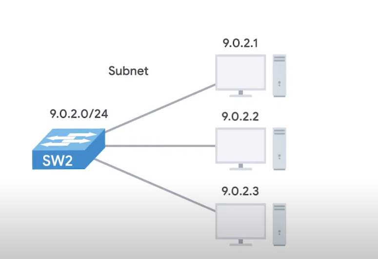

# Subnetting

The process of taking a larger network and splitting it up into many individual and smaller subnetworks or subnets.

If we want to communicate to an ip address say 9.100.100.100 the core routers on the internet knows that it belongs to the ip 9.0.0.0 class A network. They then route to the gateway router responsible for the network by looking at the network Id. A getway router essentially serves as an entry and exit path to a certain network. 

Once the packet gets to the gateway routers for the 9.0.0.0 class A network that router is now responsible for getting tht data to the proper system by looking at the host Id. the class A router will then have 16 million devices to connect to. This is where subnetting comes in.

With subnets we can split our large networks into many smaller ones. These individual subnets will have their own gateway routers serving as the ingresand egres point for each subnet. 



## Subnet Masks

- Subnet Id: We know that an IP consist of Host Id and network Id. In the world of subnetting some bits that would normally comprise host id are actually used for the subnet Id 
```
                        10.0.1.10
                        |___|_|_|
                Network Id   \   \-------\
                            Subnet Id    Host Id
```
---
Subnetting, short for "subnet addressing," is a technique used in computer networking to divide a larger network into smaller, more manageable subnetworks or subnets. This helps in optimizing network performance, managing IP address allocation, and enhancing security. Subnetting is defined by a term called subnet masks. 

In a typical IP (Internet Protocol) network, each device is assigned an IP address that consists of two parts: the network portion and the host portion. Subnetting involves borrowing bits from the host portion of the IP address to create multiple subnets within a larger network. This allows for more efficient utilization of IP addresses and facilitates better organization of devices based on their function, location, or other criteria.

Here's a breakdown of how subnetting works:

1. **IP Address Structure:** An IPv4 address is a 32-bit number usually represented as four octets (e.g., 192.168.1.1). In binary, it's represented as a sequence of 32 bits.

2. **Subnet Mask:** The subnet mask is used to distinguish between the network portion and the host portion of an IP address. It's also a 32-bit value where the leftmost bits represent the network portion, and the rightmost bits represent the host portion. The subnet mask is often expressed in dotted decimal notation (e.g., 255.255.255.0), where each decimal corresponds to 8 bits. It can also be seen as a 32 bit sequence of 1's followed by 0's. 
Example:  
255.0.0.0 or 11111111.0.0.0 -> the bits that are 1 represent the network id, and the number of zeroes represent the host part or host id. 

3. **Subnetting:** To subnet a network, you would take a portion of the host bits and allocate them to represent different subnets. For instance, if you have a network with a default subnet mask of 255.255.255.0 (or /24 in CIDR notation), you can borrow bits from the host portion to create smaller subnets. This results in a smaller range of available host addresses in each subnet but allows you to have multiple separate networks within the larger one.

4. **CIDR Notation:** Classless Inter-Domain Routing (CIDR) notation is a way of representing IP addresses and subnet masks. It uses a combination of the IP address and a prefix length (e.g., 192.168.1.0/24). The prefix length indicates the number of bits in the subnet mask that are set to 1, and it determines the size of the subnet.

Subnetting offers benefits like efficient IP address utilization, improved network performance, isolation of network segments for security purposes, and simplified network management. It's a crucial skill for network administrators and engineers who need to design, implement, and maintain complex networks.


Example: 
```
say i have an ip 193.168.13.3
and the mask as  255.255.255.0 ,so in order to find the newtwork address of this ip address
we do AND operation and the network id comes to be 192.168.13.0
```

## Process of subnetting 
Suppose we have a range of IP addresses 193.8.10.0 to 193.8.10.255 and we want to assign ip addresses to different departments in an organization. 
The organizations are CS , EC , registry and admin. and they have equal number of computers say 60. 
since they are class C network Ids they have 24 bits for network id and 8 bits for host id. So now we want to have 4 subnetworks. So the idea is to take some bits from host id. 

How do we take bits from host id. It depends upon the number of subnetworks we are creating. 
In this case we are creating 4 subnetworks. and the host id is of 8 bits so 8/4 = 2 hence we take 2 bits. from host id. 

So we create a new network id of 26 bits. and host id becomes 6 bits. 
Also we have four combinations 00, 01, 10, 11.
00 - Admin 
01 - CS
10 - Ec
11 - Registry 
and the first 24 bits is going to be same in all addresses. and if the next first two bits are 00 then it belongs to Admin. 

so admin is from 193.8.10.0 to 193.8.10.63 
How ?  last ip will have all values as 1111 so, 00111111 will be last one. 

cs will have 193.8.10.64 to 193.8.10.127 (127 is 01000000)

similarly ec -> 193.8.10.128 to 193.8.10.191
Registry -> 193.8.10.192 -> 193.8.10.255
 
They all will have same subnet mask since they're all 26 bits which will be 255.255.255.192 why so ? because we have 8 bits in the last octet we have two bits set and all other as 0's. which is 11000000. 