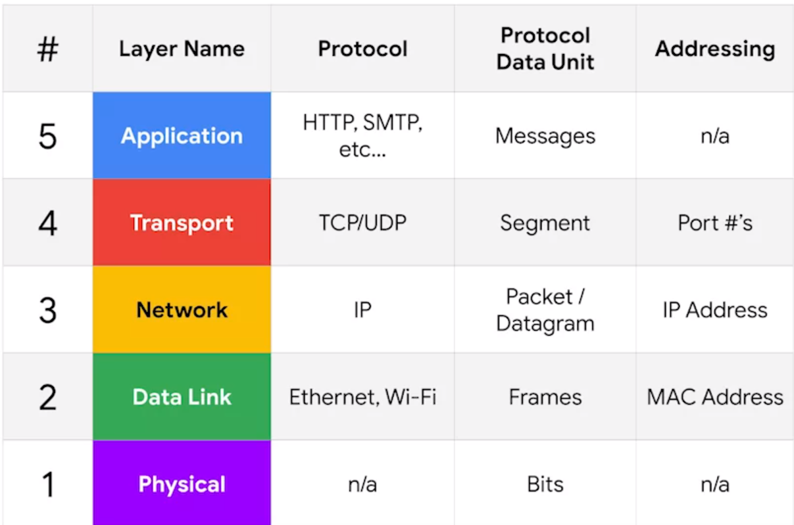

# The TCP/IP Five Layer Model

## Physical Layer 
It is the physical devices that interconnects the computers. This includes specifications for networking cables and the connectors that join devices together along with how signals are sent over this connection. 

## Data Link Layer or Network Interface or Network Access Layer 

Responsible for defining a common way of interpreting these signals so network devices can communicate.  
Lots of protocols exist on this layer but the most common one is Ethernet. 

Ethernet is the traditional technology for connecting devices in a wired local area network (LAN) or wide area network (WAN). It enables devices to communicate with each other via a protocol, which is a set of rules or common network language.
The Ethernet standards also define a protocol responsible for getting data to nodes on the same network or link.

## The Netwrok layer [The Internet Layer]

It is this layer that allows different networks to communicate with each other through devices known as Routers.
The most common protocol used at this layer is known as IP or Internet Protocol. 

## Transport layer
The transport layer sorts out which client and server programs are supposed to get the data. 
The  most common protocol in this layer is known as TCP Transmission control protocol. 
Other transport layer protocols also use IP to get around including a protocol called UDP i.e User Datagram Protocol. 
The big difference between TCP and UDP is that TCP provides mechanism to ensures that data is reliably delievered while UDP does not. 

## Application Layer 
There lots of different protocols on this layer and protocols are application specific. 
