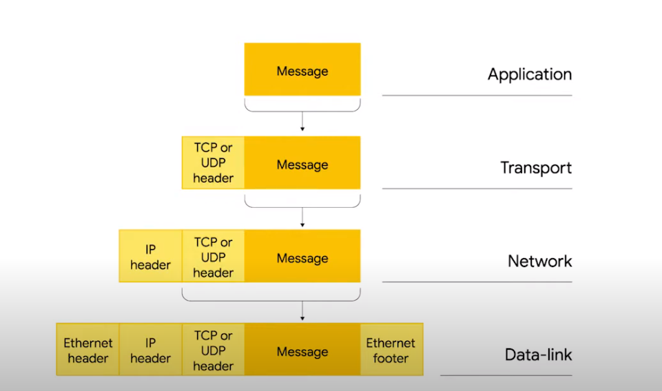

# 02. IP Datagrams & Encapsulation

Just like the packets at Ethernet layer have a specific name Ethernet Frame data packets at network layer are called IP Datagram. 
An IP datagram is a highly structured series of fields that are strictly defined. 

The two primary sections of an IP datgram are Header and payload.

The very first field is version 4 bitsand version of IP is used. The most common version is IPV4 or version 4. Version 6 is IPV6 is another one.

After that we have a Header Length field which is 1 4 bit field which descibes how long the header is. Almost always 20 bytes in length when dealing with IPV4.

Nest is Service Type field of 8 bits which can be used to specify details about quality of service or QoS technologies.

Next is 16 bit field Total Length field to indicate the total length of the Ip datgram its attached to. 

Next is Identification field a 16 bit number thats used to group messages together. Ip datgrams have a maximum size is 16 bits.
If the total amount of data that can fit in a single datagram is larger the IP layer needs to split this data up into many individual packets. When this happens the Identification field is used so that the recieving end can understand that every packet with the same value in it is part of the same transmission.

Next up we have Flags and Frament offset field. The flag field is used to indicate if a datagram is allowed to be fragmented or to indicate that the datagram has already been fragmented. 
Fragmentation is a process of taking a single IP datagram and splitting it up into several smaller datagrams.
Used for fragmentation and reassembly of large IP packets if the underlying network has a smaller maximum transmission unit (MTU).

Next is TTL. Time to Live an 8 bit field that how many router hops a datagram can traverse before it's thrown away. At each router the ttl is reduced by 1 and when it reaches it's known that id does not need to go further.

The protocol field contains information about what transport layer protocol is being used . 8 bit field. TCP and UDP

Header checksum field is the checksum of the entire IP datagram header. 

Source and Destination IP addresses are 32 bit numbers. 

Ip Options field is an optional field and is used to set special characteristics for datgrams primarily used for testing purposes.

Padding field is a series of 0's to ensure the header is the correct total size.

## ENCAPSULATION

Encapsulation, in the context of computer networking, refers to the process of wrapping data from higher-level protocols with headers and trailers specific to lower-level protocols as it traverses through different layers of the network stack. Each layer adds its own header and potentially a trailer to the data, forming a new encapsulated unit known as a protocol data unit (PDU).

As data moves down the network stack, it undergoes a process of encapsulation at each layer. The encapsulated data is then transmitted across the network infrastructure, where it is decapsulated at each receiving layer, stripping off the headers and trailers added by the corresponding encapsulating layer.
