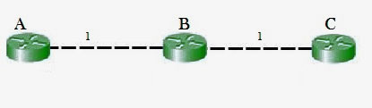

# Count to Infinity 

The main issue with Distance Vector Routing (DVR) protocols is Routing Loops since Bellman-Ford Algorithm cannot prevent loops. This routing loop in the DVR network causes the Count to Infinity Problem. Routing loops usually occur when an interface goes down or two routers send updates at the same time. 



So in this example, the Bellman-Ford algorithm will converge for each router, they will have entries for each other. B will know that it can get to C at a cost of 1, and A will know that it can get to C via B at a cost of 2. 

If the link between B and C is disconnected, then B will know that it can no longer get to C via that link and will remove it from its table. Before it can send any updates it’s possible that it will receive an update from A which will be advertising that it can get to C at a cost of 2. B can get to A at a cost of 1, so it will update a route to C via A at a cost of 3. A will then receive updates from B later and update its cost to 4. They will then go on feeding each other bad information toward infinity which is called as Count to Infinity problem.  

## Solution for Count to infinity problem: 

Route poisoning is a technique used in distance vector routing algorithms, such as the Routing Information Protocol (RIP), to address the count-to-infinity problem. The count-to-infinity problem occurs when a router in a network is unaware of a link failure, leading to incorrect distance information being propagated and causing routing loops. Route poisoning helps prevent these loops by artificially increasing the cost (distance) to an unreachable destination in order to communicate the unreachability more effectively.

Here's how route poisoning works:

1. **Link Failure:**
   Let's say a router (Router A) detects a link failure to a neighboring router (Router B). In a network without route poisoning, Router A would update its routing table to indicate that Router B is unreachable. However, this information might take some time to propagate through the network, during which routers could make incorrect routing decisions.

2. **Route Poisoning:**
   Instead of simply marking Router B as unreachable, Router A uses route poisoning to communicate this unreachability more quickly and accurately. Router A advertises a special metric value to indicate that the route to Router B is poisoned, effectively making the cost infinite or very high (e.g., 16 in RIP).

3. **Propagation:**
   When Router A's poisoned route advertisement reaches its neighbors, those neighbors understand that the route to Router B is no longer viable. They, in turn, update their own routing tables to reflect the poisoned route.

4. **Count-to-Infinity Problem Avoidance:**
   By using route poisoning, routers quickly become aware of the unreachability of a destination. This prevents the count-to-infinity problem because routers incrementally increase the cost to the poisoned destination, ultimately resulting in a high cost that discourages routing through that destination.

Here's an example of route poisoning:

Consider the network topology:

```
    A----1----B----1----C
```

1. Initially, routers A, B, and C have routing tables indicating the direct links between them.

2. If the link between routers B and C fails:
   - Router B uses route poisoning and advertises a high metric value (e.g., 16) for the route to C.
   - Router A receives this poisoned advertisement from B and updates its routing table, marking the route to C as unreachable with the high metric value.
   - Router A advertises the poisoned route to its neighbors.

3. The poison advertisement quickly propagates through the network. Routers A and B both understand that the route to C is unreachable with a high cost, preventing them from making incorrect routing decisions that might lead to loops.

By using route poisoning, routers can efficiently communicate the unreachability of destinations due to link failures, helping to avoid the count-to-infinity problem and ensuring more stable and accurate routing decisions.