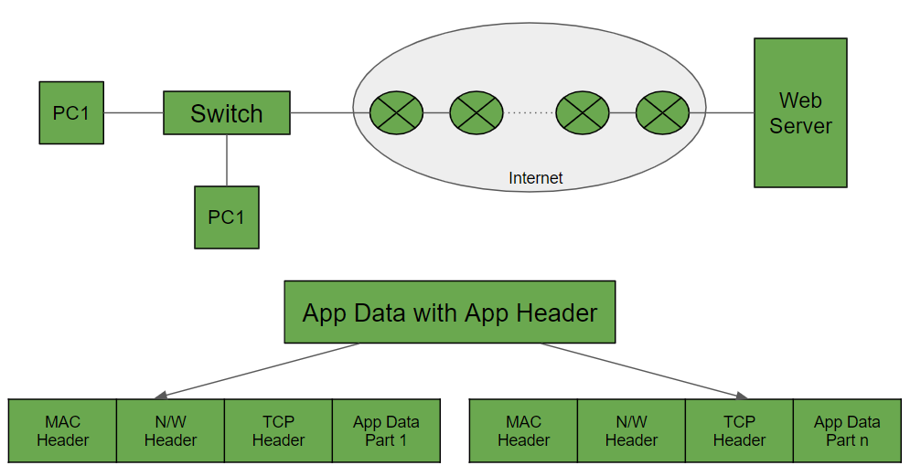

# The application layer
 The application layer is the topmost layer of the OSI Model. It is the layer in which user applications run. Various protocols run at this layer serving different requirements. Let's understand the working using the below diagram:

  
When someone browses the internet, then the browser generates Application Data with specific Header files. Following this, the transport layer breaks the Application data into various parts. To this TCP header is added to each part of the Application Data. Next comes the network layer, which adds the destination address in the network header. Then the link is made between the computer and the ISP routers. All the traffic are being sent to the routers. To send the data over the data link layer to any other routers, the computer uses MAC address where the routers MAC address is used to set the link. This MAC address is known using the ARP or Address Resolution Protocol. The switch reads the MAC header of the destination router. The routers laying on the Internet implements three layers namely network layer, DLL, and physical layer. Now finally when the data reached the webserver then using the TCP header, the webserver combines all the data.

The application layer is one of the seven layers in the OSI (Open Systems Interconnection) model, which is a conceptual framework used to understand and standardize how different networking and communication technologies interact with each other. The OSI model helps in describing the functions and interactions of various components involved in network communication.

The application layer, also known as Layer 7, is the topmost layer in the OSI model. It's the layer closest to end-users and is responsible for providing network services and application-level communication between software applications running on different devices connected to a network. The primary purpose of the application layer is to enable communication and data exchange between different applications, regardless of the underlying network infrastructure and protocols.

Key characteristics and functions of the application layer include:

1. **Data Representation and Encryption**: The application layer takes care of data translation, ensuring that data exchanged between different applications is in a format that both parties can understand. It also supports encryption and decryption of data to ensure secure communication.

2. **User Interface and Application Services**: The application layer is responsible for providing a user interface for applications to interact with users. This can include graphical interfaces, command-line interfaces, and other forms of interaction.

3. **Email Services**: Many email protocols, such as SMTP (Simple Mail Transfer Protocol) and IMAP (Internet Message Access Protocol), operate at the application layer. They enable the exchange of email messages between clients and servers.

4. **Web Services**: Protocols like HTTP (Hypertext Transfer Protocol) and HTTPS (HTTP Secure) operate at the application layer and are used for browsing the World Wide Web.

5. **File Transfer**: The application layer facilitates file transfer between devices using protocols like FTP (File Transfer Protocol) and SFTP (Secure File Transfer Protocol).

6. **Remote Access**: Protocols like SSH (Secure Shell) and RDP (Remote Desktop Protocol) enable remote access to devices and systems.

7. **Network Management**: The application layer also includes protocols for network management, such as SNMP (Simple Network Management Protocol), which allows administrators to monitor and manage network devices.

8. **Distributed Computing and Peer-to-Peer Communication**: Some modern applications rely on the application layer for distributed computing and peer-to-peer communication, enabling devices to directly communicate and share resources without a central server.

It's important to note that the application layer is concerned with the logical communication between applications rather than the physical transmission of data. The underlying layers (presentation, session, transport, network, data link, and physical) handle tasks such as data formatting, addressing, routing, error detection, and physical transmission.

In summary, the application layer acts as a bridge between the software applications users interact with and the underlying network infrastructure. It ensures that applications on different devices can communicate effectively and provides a standardized way for various applications to exchange data regardless of the specific technologies they are built upon.