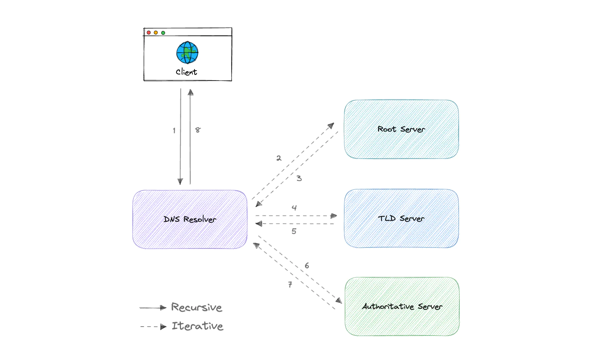

# DNS

When a user types a URL (Uniform Resource Locator) into their web browser, such as "www.example.com," the process of fetching the corresponding IP address involves multiple steps and various entities. Here's a breakdown of the process along with the roles of different DNS (Domain Name System) components using the example of "www.example.com":

1. **User Input**: The user enters the URL "www.example.com" into their web browser's address bar.

2. **Local Resolver**: The user's device (computer or smartphone) first checks its local DNS cache to see if it already knows the IP address for "www.example.com." If the IP address is found in the cache and is still valid, the process ends here, and the IP address is used to connect to the website.

3. **DNS Resolver (Recursive Resolver)**: If the IP address is not found in the local cache, the user's device contacts a DNS resolver, typically provided by the Internet Service Provider (ISP) or a third-party DNS service (e.g., Google DNS, OpenDNS). The DNS resolver is responsible for finding the IP address associated with the domain name.

4. **Root DNS Servers**: If the DNS resolver doesn't have the IP address information, it contacts a root DNS server. Root DNS servers are a critical part of the DNS infrastructure and are managed by various organizations. They maintain a list of authoritative DNS servers for top-level domains (TLDs), such as ".com," ".org," ".net," etc. The root server responds to the resolver with a referral to the appropriate TLD server for the requested domain ("example.com").

5. **TLD DNS Servers**: The resolver contacts the TLD DNS server for the specific top-level domain, in this case, the ".com" TLD server. The TLD server provides information about which authoritative DNS server is responsible for the "example.com" domain.

6. **Authoritative DNS Server**: The resolver then contacts the authoritative DNS server for "example.com." This server is typically managed by the organization that owns the domain. The authoritative server contains the specific IP address information for the requested subdomain "www.example.com."

7. **DNS Response**: The authoritative DNS server sends the IP address for "www.example.com" back to the DNS resolver.

8. **Recursive Resolver to User**: The DNS resolver caches the IP address and sends it back to the user's device.

9. **User to Website**: The user's device now has the IP address for "www.example.com." It can establish a connection to the web server hosting the website at that IP address, and the website's content is then retrieved and displayed in the user's browser.

In summary, each component in the DNS process has a specific role:

- **Local Resolver**: Checks local cache for IP addresses.
- **DNS Resolver (Recursive Resolver)**: Contacts root and subsequent DNS servers to find IP addresses.
- **Root DNS Servers**: Directs to TLD servers.
- **TLD DNS Servers**: Provides information about authoritative DNS servers.
- **Authoritative DNS Server**: Holds IP address information for specific domains.
- **User**: Initiates the process by entering a URL.

This complex process ensures that users can access websites using human-friendly domain names while the underlying system uses IP addresses for communication.

## Recursive and Iterative Lookup 

Recursive and iterative lookups are two different methods used in the Domain Name System (DNS) to resolve domain names to their corresponding IP addresses. Here's an explanation of both approaches:

1. **Recursive Lookup**:

In a recursive lookup, the DNS resolver (usually provided by your ISP or a third-party DNS service) takes on the responsibility of finding the IP address for the requested domain on behalf of the client (user's device). The process works as follows:

- The client (user's device) sends a request to the DNS resolver, asking for the IP address associated with a particular domain name.
- The DNS resolver contacts the root DNS servers, then the top-level domain (TLD) servers, and subsequently the authoritative DNS server responsible for the domain.
- The DNS resolver follows this chain of requests until it receives the final IP address from the authoritative DNS server.
- Once the DNS resolver obtains the IP address, it returns the result to the client.

Recursive lookups simplify the process for the client, as the client only needs to make a single request to the DNS resolver, which then handles all the iterative requests to various DNS servers. This method is often used by default in most DNS configurations.

2. **Iterative Lookup**:

In an iterative lookup, the DNS resolver doesn't perform all the legwork on behalf of the client. Instead, it provides the client with information about where to continue its search for the IP address. The process goes as follows:

- The client sends a request to the DNS resolver, asking for the IP address associated with a domain name.
- The DNS resolver, instead of contacting various DNS servers itself, returns a referral to the client. This referral specifies which DNS server the client should query next.
- The client then contacts the DNS server mentioned in the referral and repeats the process, receiving another referral or the final IP address.
- This iteration continues until the client obtains the IP address it was looking for.

Iterative lookups require the client to actively participate in contacting different DNS servers, which can be more time-consuming compared to recursive lookups. However, this method allows the client to have more control over the lookup process and can be useful in certain troubleshooting scenarios.

In most cases, DNS resolvers use recursive lookups to efficiently handle DNS queries for users, simplifying the process for the end user. However, iterative lookups can be valuable for debugging DNS-related issues and understanding the hierarchy of DNS servers involved in resolving a domain name.

so the root servers and TLD servers and authoritative servers do this iterative lookup since they do not give the exact ip but provide with you an intermediate direction as to the resolver. 

---
## How DNS works

### Server types

Now, let's look at the four key groups of servers that make up the DNS infrastructure.

- DNS Resolver
A DNS resolver (also known as a DNS recursive resolver) is the first stop in a DNS query. The recursive resolver acts as a middleman between a client and a DNS nameserver. After receiving a DNS query from a web client, a recursive resolver will either respond with cached data, or send a request to a root nameserver, followed by another request to a TLD nameserver, and then one last request to an authoritative nameserver. After receiving a response from the authoritative nameserver containing the requested IP address, the recursive resolver then sends a response to the client.

- DNS root server
A root server accepts a recursive resolver's query which includes a domain name, and the root nameserver responds by directing the recursive resolver to a TLD nameserver, based on the extension of that domain (.com, .net, .org, etc.). The root nameservers are overseen by a nonprofit called the Internet Corporation for Assigned Names and Numbers (ICANN).

There are 13 DNS root nameservers known to every recursive resolver. Note that while there are 13 root nameservers, that doesn't mean that there are only 13 machines in the root nameserver system. There are 13 types of root nameservers, but there are multiple copies of each one all over the world, which use Anycast routing to provide speedy responses.

- TLD nameserver
A TLD nameserver maintains information for all the domain names that share a common domain extension, such as .com, .net, or whatever comes after the last dot in a URL.

Management of TLD nameservers is handled by the Internet Assigned Numbers Authority (IANA), which is a branch of ICANN. The IANA breaks up the TLD servers into two main groups:

- Generic top-level domains: These are domains like .com, .org, .net, .edu, and .gov.
Country code top-level domains: These include any domains that are specific to a country or state. Examples include .uk, .us, .ru, and .jp.
- Authoritative DNS server
The authoritative nameserver is usually the resolver's last step in the journey for an IP address. The authoritative nameserver contains information specific to the domain name it serves (e.g. google.com) and it can provide a recursive resolver with the IP address of that server found in the DNS A record, or if the domain has a CNAME record (alias) it will provide the recursive resolver with an alias domain, at which point the recursive resolver will have to perform a whole new DNS lookup to procure a record from an authoritative nameserver (often an A record containing an IP address). If it cannot find the domain, returns the NXDOMAIN message.

## Record Types
DNS records (aka zone files) are instructions that live in authoritative DNS servers and provide information about a domain including what IP address is associated with that domain and how to handle requests for that domain.

These records consist of a series of text files written in what is known as DNS syntax. DNS syntax is just a string of characters used as commands that tell the DNS server what to do. All DNS records also have a "TTL", which stands for time-to-live, and indicates how often a DNS server will refresh that record.

These records consist of a series of text files written in what is known as DNS syntax. DNS syntax is just a string of characters used as commands that tell the DNS server what to do. All DNS records also have a "TTL", which stands for time-to-live, and indicates how often a DNS server will refresh that record.

There are more record types but for now, let's look at some of the most commonly used ones:

A (Address record): This is the record that holds the IP address of a domain.
AAAA (IP Version 6 Address record): The record that contains the IPv6 address for a domain (as opposed to A records, which stores the IPv4 address).
CNAME (Canonical Name record): Forwards one domain or subdomain to another domain, does NOT provide an IP address.
MX (Mail exchanger record): Directs mail to an email server.
TXT (Text Record): This record lets an admin store text notes in the record. These records are often used for email security.
NS (Name Server records): Stores the name server for a DNS entry.
SOA (Start of Authority): Stores admin information about a domain.
SRV (Service Location record): Specifies a port for specific services.
PTR (Reverse-lookup Pointer records): Provides a domain name in reverse lookups.
CERT (Certificate record): Stores public key certificates.

## Subdomains
A subdomain is an additional part of our main domain name. It is commonly used to logically separate a website into sections. We can create multiple subdomains or child domains on the main domain.
For example, blog.example.com where blog is the subdomain, example is the primary domain and .com is the top-level domain (TLD). Similar examples can be support.example.com or careers.example.com.

## DNS Zones
A DNS zone is a distinct part of the domain namespace which is delegated to a legal entity like a person, organization, or company, who is responsible for maintaining the DNS zone. A DNS zone is also an administrative function, allowing for granular control of DNS components, such as authoritative name servers.

## DNS Caching
A DNS cache (sometimes called a DNS resolver cache) is a temporary database, maintained by a computer's operating system, that contains records of all the recent visits and attempted visits to websites and other internet domains. In other words, a DNS cache is just a memory of recent DNS lookups that our computer can quickly refer to when it's trying to figure out how to load a website.

The Domain Name System implements a time-to-live (TTL) on every DNS record. TTL specifies the number of seconds the record can be cached by a DNS client or server. When the record is stored in a cache, whatever TTL value came with it gets stored as well. The server continues to update the TTL of the record stored in the cache, counting down every second. When it hits zero, the record is deleted or purged from the cache. At that point, if a query for that record is received, the DNS server has to start the resolution process.

## Reverse DNS
A reverse DNS lookup is a DNS query for the domain name associated with a given IP address. This accomplishes the opposite of the more commonly used forward DNS lookup, in which the DNS system is queried to return an IP address. The process of reverse resolving an IP address uses PTR records. If the server does not have a PTR record, it cannot resolve a reverse lookup.

Reverse lookups are commonly used by email servers. Email servers check and see if an email message came from a valid server before bringing it onto their network. Many email servers will reject messages from any server that does not support reverse lookups or from a server that is highly unlikely to be legitimate.

Note: Reverse DNS lookups are not universally adopted as they are not critical to the normal function of the internet.

Reverse DNS (rDNS or RDNS) is a Domain Name Service (DNS) lookup of a domain name from an IP address. A regular DNS request would resolve an IP address given a domain name; hence the name “reverse.” A special PTR-record type is used to store reverse DNS entries.